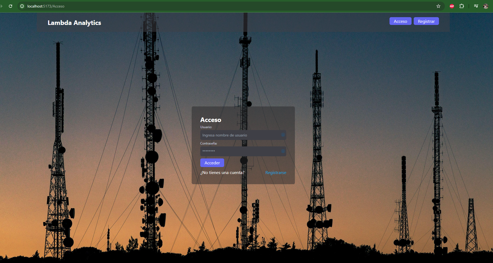
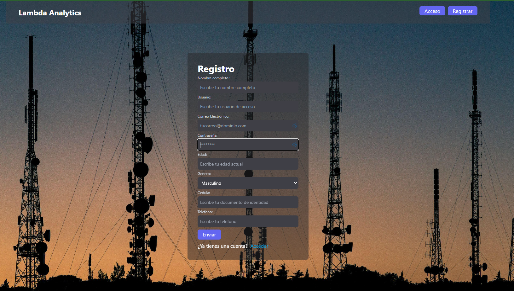
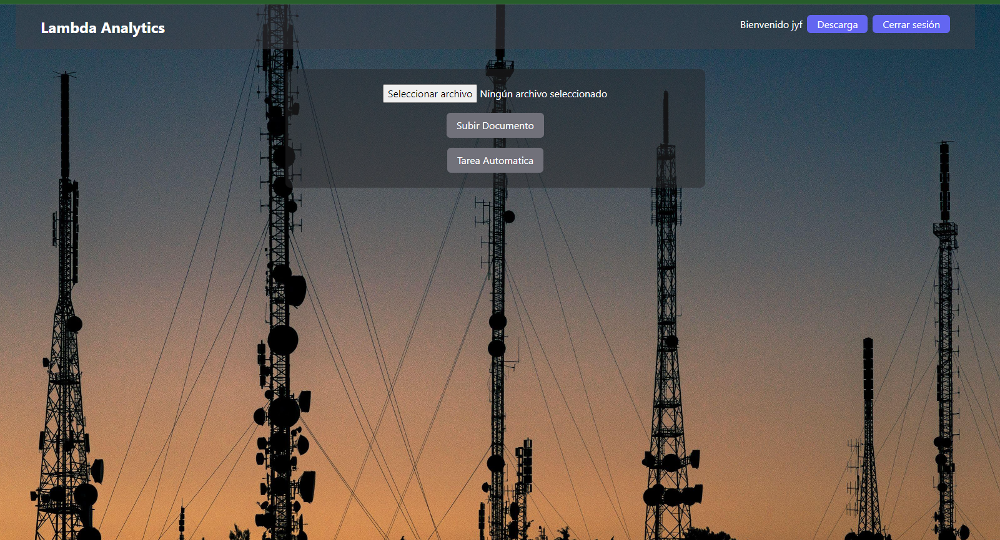

# Proyecto de Aplicación Web

Este proyecto consta de un backend construido con Django REST Framework y un frontend desarrollado con Vite y React. La aplicación ofrece una interfaz moderna y responsiva, con autenticación segura basada en tokens.

## Tabla de Contenidos

- [Descripción del Proyecto](#descripción-del-proyecto)
- [Tecnologías Usadas](#tecnologías-usadas)
- [Configuración del Entorno](#configuración-del-entorno)
  - [Backend](#backend)
  - [Frontend](#frontend)
- [Estructura del Proyecto](#estructura-del-proyecto)
- [Uso](#uso)
- [Contribuciones](#contribuciones)
- [Licencia](#licencia)

## Descripción del Proyecto

Este proyecto incluye:

- **Backend**: Desarrollado con Django REST Framework para gestionar solicitudes y respuestas API de manera segura y eficiente. Utiliza autenticación basada en tokens para mantener sesiones seguras.
- **Frontend**: Desarrollado con Vite y React para proporcionar una interfaz moderna y responsiva. React gestiona el estado de la aplicación y la representación dinámica de componentes, mientras que Vite optimiza el entorno de desarrollo.

## Tecnologías Usadas

- **Backend**: Django, Django REST Framework, Django REST Framework Authtoken
- **Frontend**: React, Vite, Tailwind CSS, PostCSS, Autoprefixer
- **Base de Datos**: Base de datos local de Django (SQLite por defecto)
- **Tareas Asíncronas**: Celery, Redis

## Configuración del Entorno

### Backend

1. **Instalación de Dependencias:**
   - Asegúrate de tener Python instalado y el entorno virtual configurado en el proyecto.
   - Abre Visual Studio Code y asegúrate de tener instalada la extensión de Python.
   - Presiona `F1` y selecciona el intérprete de Python adecuado (.venv) ya agregado al proyecto.

2. **Iniciar el Servidor:**
   - Activa el entorno virtual:
     ```bash
     source venv/bin/activate  # En Linux/Mac
     venv\Scripts\activate     # En Windows
     ```
   - Ejecuta el siguiente comando para iniciar el servidor Django:
     ```bash
     python manage.py runserver
     ```

3. **Configuración de la Base de Datos:**
   - Django usa SQLite por defecto como base de datos local. No es necesario configurar nada adicional para usar la base de datos local.

4. **Migraciones y Superusuario:**
   - Ejecuta las migraciones para configurar la base de datos:
     ```bash
     python manage.py migrate
     ```
   - Crea un superusuario para acceder al panel de administración:
     ```bash
     python manage.py createsuperuser
     ```

### Frontend

1. **Instalación de Dependencias:**
   - Asegúrate de tener Node.js instalado en tu PC.
   - Abre una terminal y navega a la carpeta `client`:
     ```bash
     cd client
     ```
   - Instala las librerías necesarias con los siguientes comandos:
     ```bash
     npm install -D tailwindcss
     npm install postcss
     npm install autoprefixer
     npm install react-router-dom
     npm install axios
     npm install js-cookie
     npm install sweetalert2
     ```

2. **Configurar Tailwind CSS:**
   - Inicializa Tailwind CSS con el siguiente comando:
     ```bash
     npx tailwindcss init -p
     ```

3. **Iniciar el Entorno de Desarrollo:**
   - Ejecuta el siguiente comando para iniciar el entorno de desarrollo:
     ```bash
     npm run dev
     ```

## Estructura del Proyecto

### Backend

- **`/documents`**: Módulo principal para la gestión de documentos.
  - **`models.py`**: Definiciones de modelos.
  - **`views.py`**: Vistas y lógica de la API.
  - **`serializers.py`**: Serializadores para los modelos.
  - **`tasks.py`**: Tareas asíncronas definidas con Celery.
  - **`urls.py`**: Rutas de la API.

- **`/tu_proyecto`**: Configuración principal del proyecto.
  - **`settings.py`**: Configuraciones del proyecto.
  - **`celery.py`**: Configuración de Celery.
  - **`__init__.py`**: Inicialización del módulo Celery.

### Frontend

- **`/client`**: Código fuente del frontend.
  - **`src`**: Código fuente principal.
    - **`components`**: Componentes React.
    - **`pages`**: Páginas principales.
    - **`utils`**: Funciones y utilidades auxiliares.
  - **`public`**: Archivos estáticos.
  - **`index.html`**: Plantilla HTML principal.

## Uso

### Backend

- **Iniciar Servidor**: `python manage.py runserver`
- **Migraciones**: Ejecuta `python manage.py migrate` para aplicar cambios en la base de datos.
- **Crear Superusuario**: Ejecuta `python manage.py createsuperuser` para crear un usuario administrador.

### Frontend

- **Iniciar Cliente**: `npm run dev`


## Imágenes

A continuación se muestran algunas imágenes relacionadas con el proyecto:

### Imagen 1


### Imagen 2


### Imagen 3
